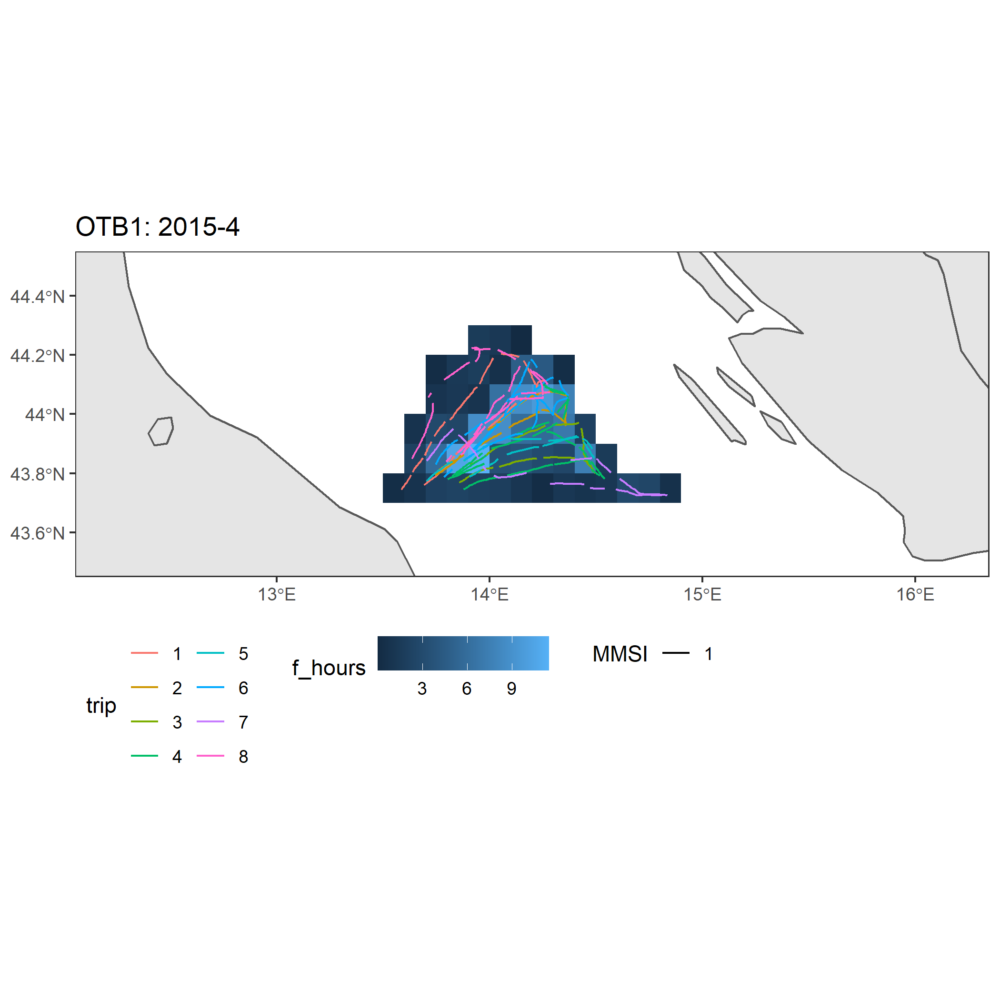

[](https://zenodo.org/badge/latestdoi/362045294)

Release notes
================

# Overview

This R code aims to analyze Automatic Identification System (AIS) data.

<p>

The processing workflow was developed on historical annotated data of the
 Adriatic Sea and aims to (i) identify individual fishing trips and (ii) 
 classify them on a monthly basis according to 5 predefined gear classes:
 bottom otter trawl (OTB), pelagic pair trawl (PTM), beam trawl (TBB), 
 purse seine (PS), and "other" fishing (OTHER, including dredges and 
 passive gears).

<p>

In this repository we release also:

  - a small subset of AIS signals broadcasted by vessels contained in the validated dataset (.csv);
  - all the parameters required to process the data, such as the input parameters needed to 
  classify fishing trips (.csv) and the trained Random Forest model (.rds) used to finally 
  assign the gear on a monthly basis and finalized to work in the Adriatic Sea
  - additional spatial layers required by the data processing (.shp).

<p>

A summary description of these data is provided in the Release notes. <br>

# Workflow
<p>


# Input data

<p>

The input data that are required to start the workflow are described
below.

## Vessel data

The workflow described below was originally created to be applied to AIS
data. However, it can be adapted to other type of tracking device data
which have at least the following structures: <br>

``` r
data = read.csv("data/datatest.csv")
head(data)
```

    ##   MMSI            datetime longitude latitude speed
    ## 1    1 2015-04-01 17:47:53   13.5027  43.6154   5.3
    ## 2    1 2015-04-01 17:52:54   13.4914  43.6291  10.2
    ## 3    1 2015-04-01 17:57:55   13.4914  43.6291  10.2
    ## 4    1 2015-04-01 18:02:55   13.4952  43.6485  11.0
    ## 5    1 2015-04-01 18:07:55   13.5068  43.6643  10.3
    ## 6    1 2015-04-01 18:12:55   13.5175  43.6790   9.5

<br>

Where:

  - vessel\_id: is the id of the vessel. In official AIS data, this
    field is the MMSI. In this work, for privacy purposes, the MMSI was
    converted into a fake id.
  - datetime: timestamp of recorded location
  - latitude-longitude: coordinates of the broadcasted positions (WGS
    84)
  - speed: instantaneous speed of the vessel (kn)

## Spatial layers

Two spatial layers are required to perform the functions that are
included in the workflow:

  - ports: a shapefile with the ports locations. Ports locations can be
    stored as point buffers or as polygon shapes. The shapefile must
    hold the following attributes for the purpose of the analysis: name,
    country and statistical Area (for our scope we use FAO Geographical
    Sub-Area; GSA).
  - coastline: a shapefile describing the zone where the use of towed
    gears is prohibited, as for Article 13(1) of Regulation (EC) No
    1967/2006: 3 nautical miles of the coast or within the 50 m isobath
    where that depth is reached at a shorter distance from the coast
    <br>

The ports and coastline layer that are provided in this repository cover
the Mediterranean areas. To reproduce the workflow described below in
other areas than Mediterranean Sea, it is necessary to achieve these
layers through manual steps. A good starting point is to have a look to
the Release data information to see the features that are required.

# Processing

The following workflow is applied on a single vessel. A similar approch
can be iterate on multiple vessels with different gear. More details are
described.

<p>

To proceed with a single vessel approach, the selection of the vessel
data it is required.

``` r
vessel = 2
data = data[which(data$MMSI == vessel),]
head(data)
```

    ##      MMSI            datetime longitude latitude speed
    ## 8858    2 2018-06-03 21:41:39   13.5002  43.6224   9.0
    ## 8859    2 2018-06-03 21:48:44   13.4905  43.6308   5.6
    ## 8860    2 2018-06-03 21:53:48   13.4836  43.6385   9.0
    ## 8861    2 2018-06-03 21:56:49   13.4768  43.6463  11.1
    ## 8862    2 2018-06-03 21:59:51   13.4693  43.6544  11.1
    ## 8863    2 2018-06-03 22:05:55   13.4540  43.6698  11.1

## Fishing session

A fishing session is a sequence of points of a vessel, from the time
vessels leave the port until they return.

<p>

The create\_fishing\_session function allows to identify the starting
and the ending point of all fishing sessions performed by a vessel, as
well as information regarding the port of departure and of arrival
(harbor name, country and statistical area).

<p>

The main argument of the function is the sequence of AIS locations of
the same vessel. Two spatial layers are required for the identification
of the “in harbour” position (i.e. the begin or the conclusion of a
fishing session). <br>

``` r
dat_session= create_fishing_trip(data, 
                                 ports,  
                                 ports_buffer, 
                                 coastal_ban_zone, 
                                 results_table = F)
head(dat_session)
```

<br>

    ##   MMSI trip     start_timestamp       end_timestamp departure arrival
    ## 1    2    1 2018-06-10 21:28:44 2018-06-12 00:04:23    Ancona  Ancona
    ## 2    2    2 2018-06-12 00:16:31 2018-06-14 06:31:33    Ancona  Ancona
    ## 3    2    4 2018-06-17 21:43:24 2018-06-19 00:07:46    Ancona  Ancona
    ## 4    2    5 2018-06-19 00:44:10 2018-06-21 05:04:30    Ancona  Ancona
    ## 5    2    6 2018-06-24 21:36:51 2018-06-26 00:00:42    Ancona  Ancona
    ## 6    2    7 2018-06-26 00:12:50 2018-06-27 00:23:02    Ancona  Ancona

<br>

The create\_fishing\_session function returns session table: <br>

  - data:
  - ports:
  - coastlines:
  - results\_table: <br>

The function assign\_session assign the correct session to each ping.
<br>

``` r
dat_with_session = assign_trip(data, 
                               trip_table)
head(dat_with_session)
```

<br>

    ##   MMSI            datetime longitude latitude speed trip
    ## 1    2 2018-06-10 21:28:44   13.5021  43.6144   1.7    1
    ## 2    2 2018-06-10 21:39:51   13.4925  43.6272   6.8    1
    ## 3    2 2018-06-10 21:45:55   13.4860  43.6376   6.7    1
    ## 4    2 2018-06-10 21:51:59   13.4827  43.6408   3.0    1
    ## 5    2 2018-06-10 21:58:04   13.4750  43.6499  11.0    1
    ## 6    2 2018-06-10 21:59:05   13.4750  43.6499  11.0    1

<br>

## Session classification and gear assigment

<p>

A kmeans analysis of the speed profile of the fishing sessions. The
analysis was repeated with 5 different set of centroids for each fishing
session. The set of centroids represent the different speed profile
characterizing the fishing gears. Centroids provided in the algorithm
were defined a priori by experts after the conclusion of the validation
procedure. The results of the kmeans analysis is a table with a gear
probability associated to each fishing session.

<p>

The provisional\_wrapper function applies a cascade of classification
algorithms on each fishing session of a vessel. The write.output
argument permit to store the data needed to train the Random Forest
model. <br>

``` r
dat_classified=classification_wrapper(vessel_data, 
                                      pars, 
                                      write.output = F, 
                                      output.name=F)
```

<br>

The output is a list of two objects:

  - “classification\_result”: contains the results of the classification
    algorithm;

<!-- end list -->

``` r
head(dat_classified[["classification_result"]])
```

<br>

    ##   MMSI trip otb1 otb2 ptm tbb ps       gaps n_ping start_month
    ## 1    2    1    0    0   0   1  0 0.09567679    236           6
    ## 2    2    2    0    0   0   1  0 0.22190249    401           6
    ## 3    2    4    0    0   0   1  0 0.00000000    241           6
    ## 4    2    5    0    0   0   1  0 0.07762446    441           6
    ## 5    2    6    0    0   0   1  0 0.00000000    241           6
    ## 6    2    7    1    1   1   1  0 0.60437641     87           6

<br>

  - “data\_labelled”: returns the input data with one additional column
    for each classification algorithm, used to indicate the type of
    activity of the point.
    <br>

<!-- end list -->

``` r
head(dat_classified[["classification_result"]])
```

<br>

    ##   MMSI trip            datetime latitude longitude otb1 ptm tbb ps otb2
    ## 1    2    1 2018-06-10 21:28:44  43.6144   13.5021    2   2   2 NA    2
    ## 2    2    1 2018-06-10 21:39:51  43.6272   13.4925    2   2   4 NA    2
    ## 3    2    1 2018-06-10 21:45:55  43.6376   13.4860    2   2   4 NA    2
    ## 4    2    1 2018-06-10 21:51:59  43.6408   13.4827    2   2   2 NA    2
    ## 5    2    1 2018-06-10 21:58:04  43.6499   13.4750    2   2   2 NA    2
    ## 6    2    1 2018-06-10 21:59:05  43.6499   13.4750    6   6   6 NA    6
    ##   start_month
    ## 1           6
    ## 2           6
    ## 3           6
    ## 4           6
    ## 5           6
    ## 6           6

<br>

## Fishing activity

<p>

Fishing gear are assigned to vessels at monthly base using random forest
(Liaw and Wiener ([2018](#ref-Liaw2018))). The model was trained to
accommodate the variability in the prediction of the session
classification algorithm.

<p>

The model was trained using the information retrieved from the validated
dataset. A subset of the validate dataset, containing about 10% of the
vessels for each fishing gear category observed within it, were excluded
from the training and it was used as validation
    dataset.

``` r
gear = decision_gear(data = dat_classified[["classification_result"]])
```

<br>

    ##   MMSI otb1 otb2 ptm tbb ps start_month valid_trips ratio_otb1 ratio_otb2
    ## 1    2    1    1   1   7  0           6           7  0.1428571  0.1428571
    ##   ratio_ptm ratio_tbb ratio_ps gear
    ## 1 0.1428571         1        0  TBB

<br>

<p>

Following, fishing sessions are segmented accordingly to their speed
profile. Fishing segment are defined recycling the clusters obtained
from kmeans analysis. Specifically, fishing segments are created
considering the clusters obtained using the set of centroids
corresponding to the gear assigned by random forest.

<p>

The speed clusters represent different phase of the activity
(i.e. mainly steaming and fishing). The set of points belonging to
clusters corresponding to fishing speed range are segmented, according
to their session and their timing, to create the fishing segments.
<br>

``` r
fishing_points=identify_fishing_points(data=dat_classified[["data_labelled"]], gear=gear)
head(fishing_points)
```

<br>

    ##   MMSI            datetime trip fishing gear geometry
    ## 1    2 2018-06-10 21:28:44    1       0  TBB    POINT
    ## 2    2 2018-06-10 21:39:51    1       0  TBB    POINT
    ## 3    2 2018-06-10 21:45:55    1       0  TBB    POINT
    ## 4    2 2018-06-10 21:51:59    1       0  TBB    POINT
    ## 5    2 2018-06-10 21:58:04    1       0  TBB    POINT
    ## 6    2 2018-06-10 21:59:05    1       0  TBB    POINT

<br>

``` r
fishing_tracks=make_fishing_tracks(data=fishing_points, coord_sys=wgs, pars=pars)
head(fishing_tracks)
```

<br>

    ##   MMSI year month gear trip id_track              s_time              f_time
    ## 1    2 2018     6  TBB    1        2 2018-06-10 22:28:24 2018-06-10 22:59:50
    ## 2    2 2018     6  TBB    1        4 2018-06-10 23:23:05 2018-06-10 23:47:22
    ## 3    2 2018     6  TBB    1        6 2018-06-11 00:17:43 2018-06-11 00:48:03
    ## 4    2 2018     6  TBB    1        8 2018-06-11 01:12:20 2018-06-11 02:01:53
    ## 5    2 2018     6  TBB    1       10 2018-06-11 02:24:09 2018-06-11 03:01:36
    ## 6    2 2018     6  TBB    1       12 2018-06-11 03:30:56 2018-06-11 04:07:19
    ##   range  geometry
    ## 1    NA LINESTING
    ## 2    NA LINESTING
    ## 3    NA LINESTING
    ## 4    NA LINESTING
    ## 5    NA LINESTING
    ## 6    NA LINESTING

<br>

## Estimate fising effort

<p>

Finally, the estimate\_fishing\_session estimated the fishing hours of a
vessel, respect an input cell grid. It return a spatial layer with
fishing effort aggregated in each cell grid. <br>

``` r
vessel_grid=estimate_fishing_effort(fishing_tracks, grid=grid)
head(vessel_grid)
```

<br>

    ##   grid_id  long   lat gear    f_hours geometry
    ## 1   26671 13.25 43.75  TBB 12.8032546  POLYGON
    ## 2   26672 13.35 43.75  TBB 11.2467569  POLYGON
    ## 3   26673 13.45 43.75  TBB  0.8733817  POLYGON
    ## 4   26726 13.05 43.85  TBB  3.9796769  POLYGON
    ## 5   26727 13.15 43.85  TBB 12.0113021  POLYGON
    ## 6   26728 13.25 43.85  TBB  7.2591725  POLYGON

<br>

# Single command function

The classification\_workflow function applies all the functions
presented in the previous section in one single command. <br>

<br>

``` r
fishing_tracks=classification_workflow(data=data,
                                       ports=ports, 
                                       ports_buffer=port_buf,
                                       coastline=coastline,
                                       pars=pars,
                                       coord_sys=wgs,
                                       output.type="segments")
```

<br>

# Output

fishing tracks can be aggregate using a spatial grid and the results can
be plotted


# Multiple vessels with different gears

To apply the workflow to multiple vessel and output with different
temporal aggregation (i.e. by year and month), the analysis can be
arranged as follow: <br>

1.  Create fishing segment for all vessel in unique list. Each element
    of the list is a list containing single vessel data and its length
    depend on the number of different gear predicted for this vessel
    <br>

<br>

``` r
all_dat<-read.csv("data/datatest.csv")
all_dat=all_dat[,c("MMSI", "datetime", "longitude", "latitude", "speed")]
all_dat$MMSI=as.character(all_dat$MMSI)
vessels=unique(all_dat$MMSI)
all_fishing_tracks=list()
for(i in 1:length(vessels)){
  cat("\n", "vessel", i, "of", length(vessels))
  cat("\n")
  xvessel=all_dat[which(all_dat$MMSI == vessels[i]),]
  fishing_tracks=classification_workflow(data=xvessel,
                                         ports=ports, 
                                         ports_buffer=port_buf,
                                         coastline=coastline,
                                         pars=pars,
                                         coord_sys=wgs,
                                         output.type="segments")
  all_fishing_tracks[[i]]=fishing_tracks
  names(all_fishing_tracks)[i]=vessels[i]
}
```

<br>

2.  To aggregate fishing activity of all vessel using the same gear, in
    the same time frame. The first rows of the following code allow to
    select from the list of above all fishing session that are
    classified with the same vessel. Effort of different vessels using
    the same fishing gear in the same time frame, are aggregate with
    respect a spatial grid to produce to monthly pattern of spatial
    activity. In the last rows, grid data are saved in tabular dataframe
    or in spatial maps.

<br>

``` r
ref_gear=c("OTB", "PTM", "PS", "TBB", "OTHER")

for(j in 1:length(ref_gear)){
  xx=lapply(all_fishing_tracks, function(x){
    rbindlist(lapply(x, function(y){
      if(unique(y$gear) == ref_gear[j]){
        return(y)
      }
    }))
  })
  xgear=ldply(xx, data.frame)
  ref_time=unique(data.frame(xgear)[,c("year", "month")])
  for(i in 1:nrow(ref_time)){
    xvessel=xgear[which(xgear$year == ref_time$year[i] & xgear$month == ref_time$month[i]),]
    xvessel_ls=list(xvessel)
    xmap=estimate_fishing_effort(xvessel_ls, grid=grid)
    xmap=ldply(xmap, data.frame)
    xmap$year=ref_time$year[i]
    xmap$month=ref_time$month[i]
    xmap$gear=ref_gear[j]
    xmap=st_sf(xmap)
    saveRDS(xmap, file.path(outdir, "tables", paste0(ref_gear[j], "_", ref_time$year[i], "-", ref_time$month[i], ".rData")))
    worldmap=st_crop(worldmap, st_buffer(xmap, 2.5)) # create map
    xrange = extendrange(xmap$long, f = 1) 
    yrange = extendrange(xmap$lat, f = 1) 
    xvessel_sf=st_sf(xvessel)
    ggplot()+
      geom_sf(data=worldmap)+
      geom_sf(data=xmap, aes(fill=f_hours), color=NA) +
      geom_sf(data=xvessel_sf, aes(linetype=MMSI, colour=as.factor(session))) + 
      coord_sf(xlim=xrange, ylim=yrange) + 
      theme_bw() +
      theme(legend.position = "bottom",
            legend.direction = "horizontal") +
      guides(colour = guide_legend(title = "session", nrow = 4)) +
      ggtitle(paste0(ref_gear[j], ": ", ref_time$year[i], "-", ref_time$month[i]))
    ggsave(file.path(outdir, "plots", paste0(ref_gear[j], "-", ref_time$year[i], "-", ref_time$month[i], ".png")))
  }
}
```

<br>

<p>

<br> 

<p>

<br>

<p>

<br> 

<p>

<br>

<p>

<br> 

<p>

<br>

<p>

<br> 

<p>

<br>

# References

<div id="refs" class="references">

<div id="ref-Liaw2018">

Liaw, Andy, and Matthew Wiener. 2018. “Package ’randomForest’. Breiman
and Cutler’s Random Forests for Classification and Regressionage
randomForest.”
<https://cran.r-project.org/web/packages/randomForest/index.html>.

</div>

</div>
